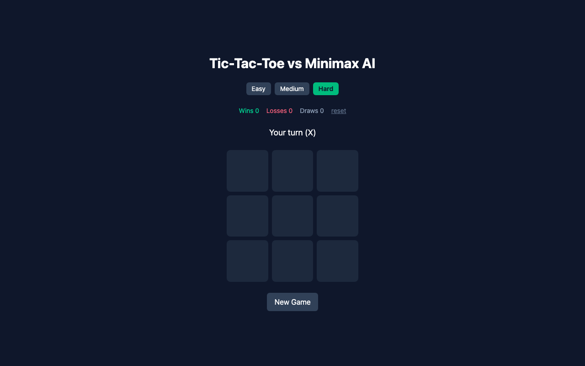

# 🎮 Tic-Tac-Toe vs Minimax AI

절대 지지 않는 AI와 틱택토 대결! Minimax 알고리즘으로 구현된 AI를 이겨보세요.


## 🔗 라이브 데모

**👉 [https://tictactoe-ai-lake.vercel.app](https://tictactoe-ai-lake.vercel.app)**



## ✨ 주요 기능

- 🤖 **Minimax 알고리즘 AI** — 서버 없이 브라우저에서 실시간 계산
- 🎚️ **난이도 3단계** — Easy / Medium / Hard (Hard는 절대 지지 않습니다)
- 📊 **전적 기록** — 승/패/무 횟수를 localStorage에 저장, 브라우저를 닫아도 유지
- 🌙 **다크 테마 UI** — Tailwind CSS 기반의 깔끔한 인터페이스

## 🛠️ 기술 스택

- React 19 + TypeScript
- Vite
- Tailwind CSS v4
- 순수 클라이언트 사이드 (백엔드 없음)

## 🚀 로컬 실행

```bash
npm install
npm run dev
```

## 🧠 AI 동작 원리

Minimax 알고리즘은 가능한 모든 수를 끝까지 시뮬레이션해서 최선의 수를 선택합니다.
난이도는 랜덤 수를 섞는 비율로 조절됩니다:

| 난이도 | 랜덤 수 비율 |
|--------|-------------|
| Easy   | 80%         |
| Medium | 40%         |
| Hard   | 0% (완벽)   |
